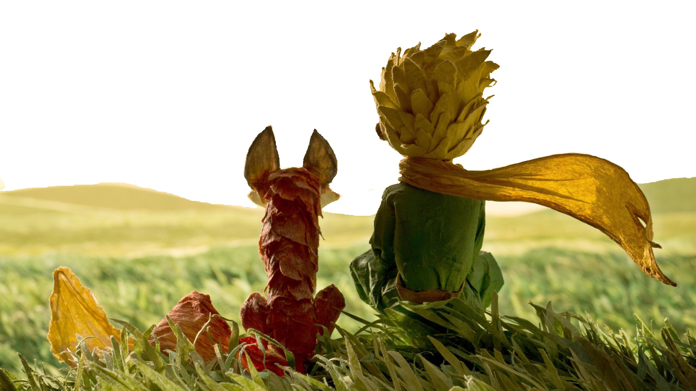

# HOLA MUNDO... Soy Vivi 👋

Desarrolladora Front-End formada en Laboratoria. Soy una persona entusiasta, creativa y muy positiva; Me apasiona desarrollar proyectos que no solo sean funcionales sino que tengan sentido, que cuenten con una interfaz limpia y eficiente brindando un grata experiencia de usuario. Me encanta leer y socializar con personas que amplíen mis horizontes y me muevan a buscar nuevas metas y desafíos; Tengo experiencia en el desarrollo de Apps y sitios web utilizando HTML, CSS, JAVASCRIPT y TYPESCRIPT; con conocimientos en Ionic, SCRUM, Figma, Trello, Github, Firebase, REACT, entre otros.

